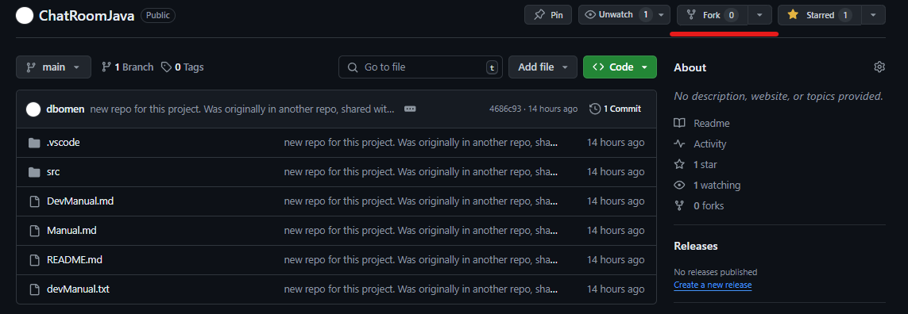
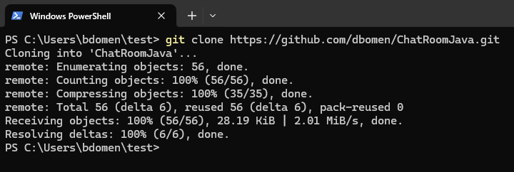
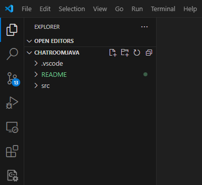
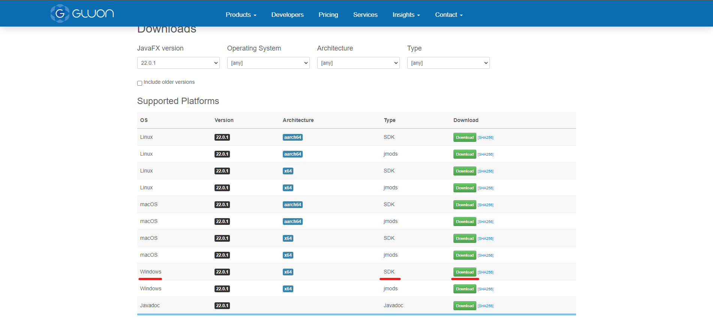
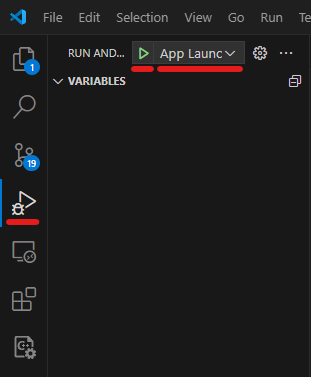
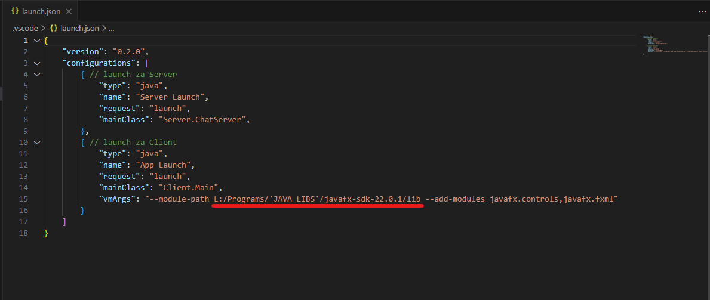

# MANUAL

This manual explains the installation process and how to use/test the application.

**Headers:**
- [INSTALATION](#instalation)
- [HOW TO USE](#how-to-use)

## INSTALATION

**What you need:**
- GitHub account
- Visual Studio Code (for now)
- Java JDK

**Headers:**
- [REPOSITORY](#repository)
- [DEPENDENCIES](#dependencies)
- [COMPILING AND RUNNING](#compiling-and-running)

### REPOSITORY
- **Fork the repository**\
    Click on the "Fork" button and go to your forked version of this repository.\
    
    ___
    Make sure you are on your forked version.\
    
    ___

- **Clone the repository**\
    Copy the clone link.\
    
    ___
    Open CMD, move to the folder where you want to have the repository and type: "git clone *link*", replacing *link* with your link.\
    
    ___
    You now have have a local copy of your forked version of the repository. Open Visual Studio Code and open the project (in VS code, you can use CTRL + O, and select "ChatRoomJava")\
    
    
    ___

### DEPENDENCIES

The last thing you have to do is install the dependencies. I have plans to convert this project into a Maven/Gradle project, but for now this will do. See the file .vscode/settings.json. Here you can see all the "referenced Libraries" that this project is dependent on.\

- One is **GSON**, a library that makes it easier to work with JSON's in Java. [Link](https://search.maven.org/artifact/com.google.code.gson/gson/2.11.0/jar?eh=)
- The other one is **JavaFx**, a GUI library that allows me to make a GUI in Java. [Link](https://gluonhq.com/products/javafx/)

If you do not trust my links or if they are not working, you can also type *gson* and/or *javafx* in Google and download them that way. You have to install the JAR files from both libraries, put them into a folder of your choosing and then change the path in the settings.json file (see the underlined area in the previous picture).

___

### COMPILING AND RUNNING

Since the repository has the .vscode/launch.json for both the Server and the Client, you can run the applications by going to "Run and Debug" (or Ctrl + Shift + D).\

Here you can select if you want to run the Server or the app and then run them by pressing the green run button. You should be able to run the server, but you have to change one more thing to be able to run the Client side (aka the app). Go to .vscode/launch.json and change the path, underlined in the image below, to where you downloaded the javafx SDK (make sure you include /lib).

## HOW TO USE

// TODO:
functionalities pejt cez kako se nardi

---
IDEJA:
server dobi nek formatiran message od Clienta, to interpretira server side, kar mora narediti

FORMATI:

START UP (SWIFT):
1) "/singup": tells server that client wants to singup, dobi potem se ime - skos gleda ce je vredu, ko je vredu connecta
2) else (aka login): tells server that client wants to log in, dobi ime, pogleda: {ce je ze online, ce obstaja}, ce je vse vredu connecta

CONNECTED
LOGGED IN ACTIONS (JAVAFX):
1) shows offline messages (IF HE HAS ANY) to client

CLIENT ACTIONS:
1) "" (aka broadcast): client is requesting broadcast message, 
    1.1) server sends the message to all ONLINE clients
2) "@": (aka private message for ONLINE): client is requesting private message to ONLINE USER, 
    2.1) server reads the name after '@', 
    2.2) it checks if the users exists or if the user is offline
        2.2.1) Sends appropriate error message
    2.3) sends message
3) "/" (aka command): client is requesting some command
    3.1) "usersO": shows all online users
    3.2) "users": shows all users
    3.3) "history @<NAME>": shows history with appropriate user
    3.4) "OFF @<NAME> <message>": sends message to user that is offline (IF USER EXISTS)

HOW TO RUN:
$L:\.zrelo obdobje\.School\programiranje\projects\ChatRoomJava\src

LAUNCH: glej launch.json
REFERENCED LIBS: glej settings.json