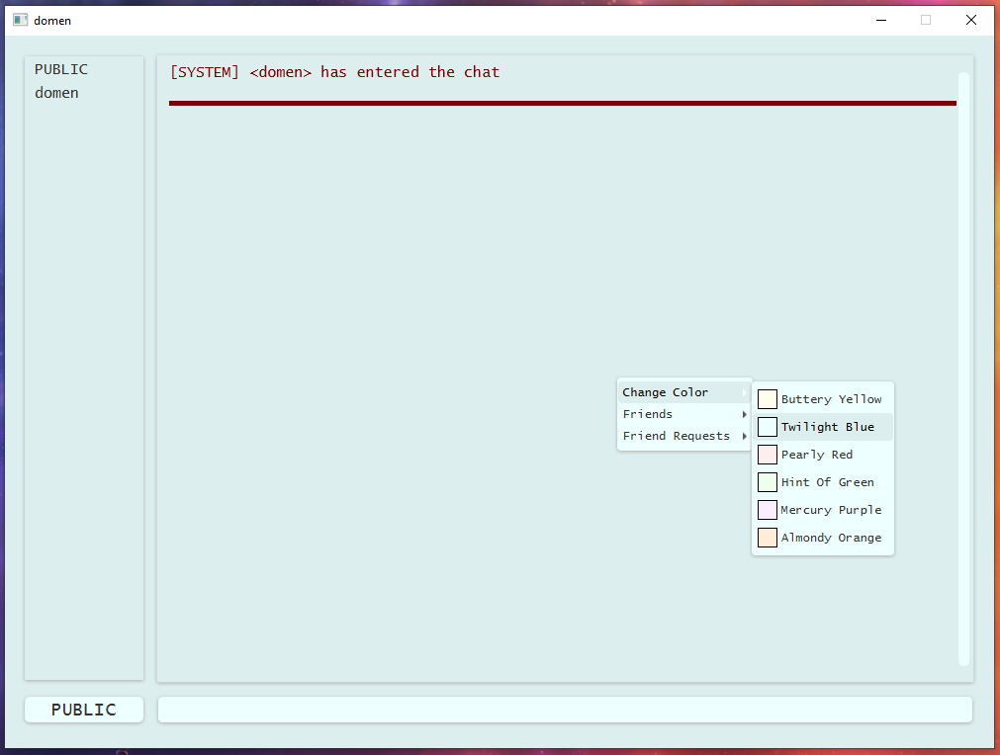

# MANUAL

This manual explains the installation process and how to use/test the application.

**Headers:**
- [INSTALATION](#instalation)
- [HOW TO USE](#how-to-use)

## INSTALATION

**What you need:**
- GitHub account
- Visual Studio Code (for now)
- Java JDK

**Headers:**
- [REPOSITORY](#repository)
- [DEPENDENCIES](#dependencies)
- [COMPILING AND RUNNING](#compiling-and-running)

### REPOSITORY
- **Fork the repository**\
    Click on the "Fork" button and go to your forked version of this repository.\
    
    ___
    Make sure you are on your forked version.\
    
    ___

- **Clone the repository**\
    Copy the clone link.\
    
    ___
    Open CMD, move to the folder where you want to have the repository and type: "git clone *link*", replacing *link* with your link.\
    
    ___
    You now have have a local copy of your forked version of the repository. Open Visual Studio Code and open the project (in VS code, you can use CTRL + O, and select "ChatRoomJava")\
    \
    
    ___

### DEPENDENCIES

The last thing you have to do is install the dependencies. I have plans to convert this project into a Maven/Gradle project, but for now this will do. See the file .vscode/settings.json. Here you can see all the "referenced Libraries" that this project is dependent on.\

- One is **GSON**, a library that makes it easier to work with JSON's in Java. [Link](https://search.maven.org/artifact/com.google.code.gson/gson/2.11.0/jar?eh=)
- The other one is **JavaFx**, a GUI library that allows me to make a GUI in Java. [Link](https://gluonhq.com/products/javafx/)

If you do not trust my links or if they are not working, you can also type *gson* and/or *javafx* in Google and download them that way. You have to install the JAR files from both libraries, put them into a folder of your choosing and then change the path in the settings.json file (see the underlined area in the previous picture).\
\

___

### COMPILING AND RUNNING

Since the repository has the .vscode/launch.json for both the Server and the Client, you can run the applications by going to "Run and Debug" (or CTRL + SHIFT + D).\

Here you can select if you want to run the Server or the app and then run them by pressing the green run button. Now you have to change two more things to be able to run the application:
- Go to .vscode/launch.json and change the path, underlined in the image below, to where you downloaded the javafx SDK. If your path includes spaces use ('), as you can see on my path with 'JAVA LIBS'.\

- Go to src/Server/ChatServer.java and change the path, underlined in the image below, to the path of your repository. Make sure to include "src/Server/db"\

Keep in mind that it might take a little time for the program to work. I recommend that you open the *ChatServer.java* and *ChatClient.java* files and wait a minute for them to load. I conducted an experiment on another laptop by following the Installation section of this manual. That laptop was not very powerful and needed some time. Initially, I encountered errors on the client side for about one minute, but then the errors stopped, and the program worked.

## HOW TO USE

To run the application:
1) Open "Run and Debug" (or press CTRL + SHIFT + D).
2) Select "Server Launch" and press the green run button.
3) To run the Client, select "App Launch" and press the run button.

You should only run one server at a time, but you can run multiple client applications simultaneously.

The following text explains how to use and test the application. I also created a short video demonstrating all the features below: [link](https://www.youtube.com/watch?v=JDjVa-9h8oU).

Headers:
- [SERVER SIDE](#server-side)
- [CLIENT SIDE](#client-side)

### SERVER SIDE

To use the application, you don't need to worry about the server side. The server runs continuously as a passive program, responding to client requests.

### CLIENT SIDE

When you first open the application, you will see the login/signup menu, built in Swift. If there are any errors, you will see the server's response in the text area. You have two options:

- **Login**: Choose an account and password from src/Server/db/users/.\

- **Signup**: Input your username and password, which will be saved to the server's database.\

After logging in, you will see the main application. In version 1.0.1, the available actions and functionalities are:
- [MESSAGES](#messages)
    - [PUBLIC MESSAGES](#public-messages)
    - [PRIVATE MESSAGES](#private-messages)
    - [OFFLINE MESSAGES](#offline-messages)
- [ACTIONS](#actions)
    - [HISTORY](#history)
    - [COLOR](#color)
    - [FRIENDS](#friends)

#### MESSAGES

To send a message, type it into the input field and press ENTER. The box to the left of the input field indicates the reciever. If it says "PUBLIC", your message will be sent to everyone who is online. Otherwise, it will display a specific user's name, indicating a private message.

To change the reciever, click on a user in the left menu, which shows all online users. Clicking on "PUBLIC" or *your own name* sets the reciever to "PUBLIC." Alternatively, you can type "@*reciever* (*your message*)" at the beginning of your message. (don't forget about the space between the recievers name and your message)

##### PUBLIC MESSAGES

As the name suggests, a public message will be seen by everyone online and will appear in black. To send a public message, select "PUBLIC" or *your own name* from the left menu. Alternatively, you can use the command "@PUBLIC (*your message*)" at the beginning of your message.\

##### PRIVATE MESSAGES

Private messages are only seen by you and the reciever and appear in blue. To send a private message, select the reciever's name from the menu or use the command "@*reciever* (*your message*)" in the input field. Using the command is useful if you want to send a private message to someone who is not currently online and therefore not listed in the menu.\

##### OFFLINE MESSAGES

When someone sends you a private message while you are offline, it will be saved on the server and displayed when you log in. Sending a private message to someone who is offline is known as sending an offline message.\

#### ACTIONS

Actions can either visually change the application interface or interact with the server to give or request information.

##### HISTORY

History with a user is a collection of your previous conversations with them, saved server-side and limited to 50 messages. You can view this history by right-clicking on the user's name in the left menu and selecting "Show History," or by using the command "@*user* /H" in the input field. The command is useful for viewing the history with someone who isn't online.\
\
\

##### COLOR

By right-clicking anywhere outside the menu and hovering over the *Change Color* section, you can change the color of the application. There are currently six colors to choose from:
- Buttery Yellow (the original/default color)
- Twilight Blue
- Pearly Red
- Hint Of Green
- Mercury Purple
- Almondy Orange

##### FRIENDS

Friends is a feature released in version 1.0.1. It allows you to permanently add or remove friends and perform actions through the context menu of the application. You can add friends by right-clicking on a user in the left online user list and selecting *Send Friend Request*. The friend request will be saved on the receiver's account until they accept or decline it.

You can see your friends or friend requests by right-clicking and hovering over the *Friends* or *Friend Request* section. If your friend is online, a friend symbol will appear in front of their name in the online user list on the left. The current actions available between friends are:
- Unfriend
- Send private message
- Show history

You can also get system messages related to the friends feature upon login. These messages can be:
- A reminder if you have more than one pending friend request
- Information about friends-related activity while you were offline, such as:
  - Receiving a new friend request
  - Someone declining your friend request
  - Someone accepting your friend request
  - Someone unfriending you

